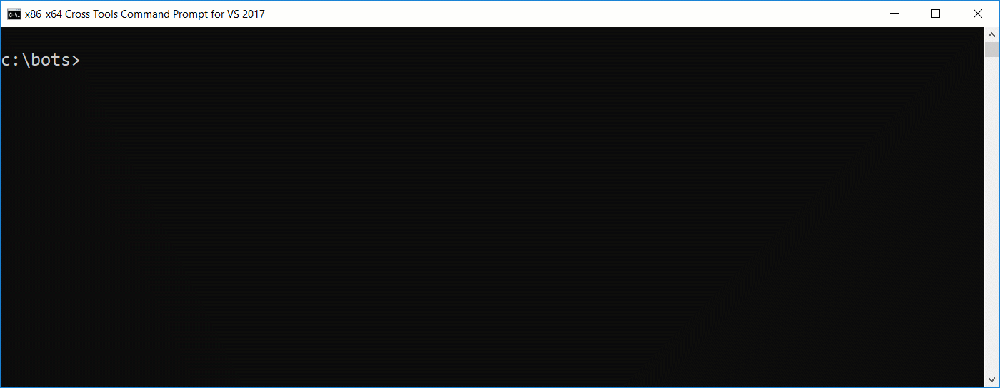

# Microsoft Bot Framework dotnet bot template

A project template for developing C# bots with Microsoft Bot Framework and .NET Core.

## Getting Started

These instructions show you how to install and use the template.

### Prerequisites

This has been tested with .NET Core version 2.1, so should work with this version or above.

### Installing

Open a command prompt and run:

```
dotnet new -i msbot-template
```

This will make the `msbot` template available for you to use with new .NET Core applications.

### Running



Create a new application using this template:

```
dotnet new msbot --name "HelloWorld"
```

**Note: your bot user id/password is blank in appsettings.json, be sure to change this before using with public channels.**

You should see a confirmation. Next, navigate into the new application folder:

```
cd HelloWorld
```

Start the application:

```
dotnet run
```

You will see the AspNetCore WebHost running your bot. You can launch the Bot Framework channel emulator and connect to your bot on ```http://localhost:port/api/messages```

**Note: The AspNetCore WebHost is configured by default to use HTTP only for development.**


## License

This project is licensed under the MIT License.
